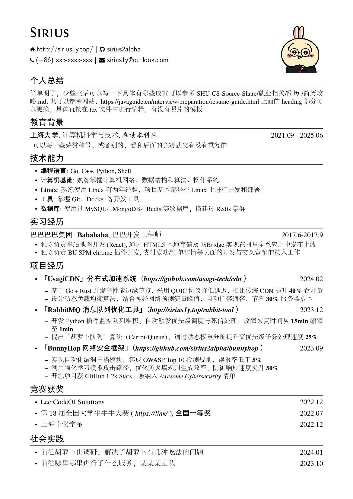

# 个人简历

本项目为个人简历 Latex 源码存放，同时包含效果图呈现，简历代码文件为 resume-zh_CN.tex

项目修改自 [resume](https://github.com/hijiangtao/resume)，新增了带照片的heading

简历内容详细攻略：[SHU-CS-Source-Share](https://github.com/1051727403/SHU-CS-Source-Share/blob/main/%E5%B0%B1%E4%B8%9A%E7%9B%B8%E5%85%B3/%E7%AE%80%E5%8E%86/%E7%AE%80%E5%8E%86%E6%94%BB%E7%95%A5.md)

## 项目说明

一个的 LaTeX 简历模板

*注：由于使用到 `fontspec` 包，编译器需选择 XeLaTeX。*

## 特性

- 极其容易定制和扩展 (`res`模板中枪倒地...)
- 完善的 Unicode 字体支持, 因为用的是 XeLaTeX 
- 完美的中文支持，使用 Adobefonts
- 支持 FontAwesome 4.3.0 (目前还不支持使用别名)

### 效果输出

感觉效果最好的是文字左对齐，照片右对齐；
tex文件中还有图左文右等样式

## 使用方法

1. OverLeaf 在线编译
2. 使用较新的 LaTeX 发行版在本地计算机编译

如果系统已确定安装有 Adobe 的四套中文字型，在文档的开始处使用包`zh_CN-Adobefonts_internal`, 如果没有安装则使用包`zh_CN-Adobefonts_external`, 在 ShareLaTeX 上编译需要使用包`zh_CN-Adobefonts_external`.

### 宏

- `\name`: 姓名
- `\contactInfo`: 联系信息, 需要三项信息，分别是{邮箱}{手机号}{个人主页}
- `\basicContactInfo`: 简要的联系信息, 需要 项信息, 分别是{邮箱}{手机号}, 没有个人主页的用这个
- `\section`: 用于分节, 如教育背景, 实习/项目经历等
- `\subsection`: 用于小节标题, 无日期选项
- `\datedsubsection`: 用于小节标题, 简历中使用最广，第二项为时间区间，自动右对齐
- `\itemize`: 清单列表，简历中应用最广
- `\enumerate`: 枚举列表，数字标号

新增：

- `\tableInfo`：姓名、主页左对齐；电话、邮箱右对齐
- `\rightInfo`:姓名、主页、电话、邮箱右对齐
- `\leftInfo`：姓名、主页、电话、邮箱左对齐

### FontAwesome

首先在 [Font Awesome Icons](http://fortawesome.github.io/Font-Awesome/icons/) 上选中自己想使用的图标(暂不支持 alias)，然后在 [fontawesome.sty](https://github.com/billryan/resume/blob/zh_CN/fontawesome.sty) 中找到相应的宏, 将其作为普通文本一样使用。

其他的可以自行参考相应 cls 和 tex 文件。

## License

[The MIT License (MIT)](http://opensource.org/licenses/MIT)

Copyrighted fonts are not subjected to this License.
